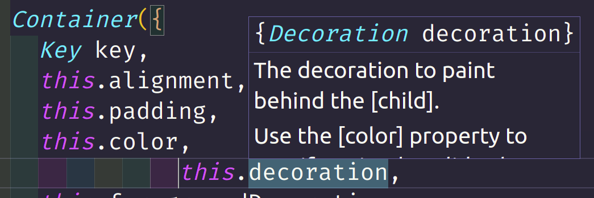
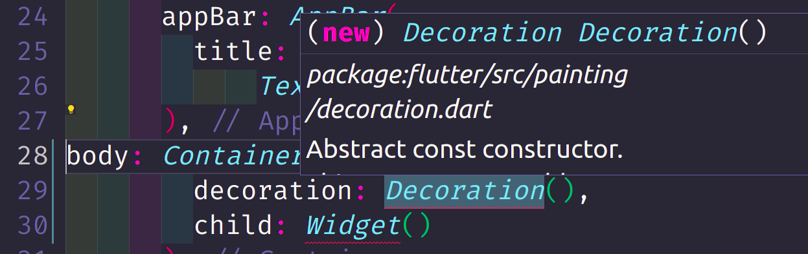
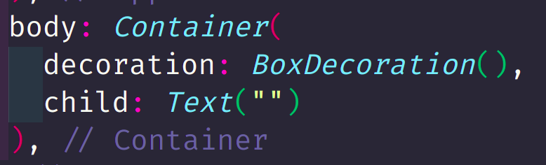

# Bridge
Separa a abstração da sua implementação, permitindo que ambos variem.

A abstração mantém uma referência da interface de implementação, permitindo que ela receba uma das suas classes concretas e referência seus métodos específicos de criação dentro do seu método geral.
 
## Exemplos:
1. Se possuímos três classes concretas (c1, c2, c3) da nossa abstração, e quiséssemos que cada uma delas tivesse duas formas de implementação diferentes (I1, I2), teríamos ao todo 6 classes (c1I1, c1I2, c2I1, c2I2, c3I1, c3I2). Adicionando uma nova classe concreta ou uma nova implementação é possível ver como o número de combinações cresce rapidamente.

   **Número de classes = (número de classes concretas * número de classes de implementação)**

   Contudo, se nossas classes concretas puderem receber por parâmetro o tipo de implementação que elas vão usar, diminuímos o número de classes para a somatória dos dois grupos.

   **Número de classes = (número de classes concretas + número de classes de implementação)**

2. Observando os componentes do framework flutter percebi uma estrutura similar. Os componentes costumam receber outros que cuidam de parte da sua implementação. Na imagem abaixo temos os parâmetros que a classe container recebe, um desses parâmetros é o decoration do tipo Decoration.

   

   Contudo, Decoration é a classe abstrata e ela não pode ser implementada, como alertado na imagem abaixo.

   

   Devemos passar uma das suas instâncias concretas.

   
 
 
## Código
O código tenta reproduzir o exemplo do flutter. Temos uma classe Widget que abstrai componentes exibidos na tela. Uma classe abstrata Forma que cuida de diferentes formas e duas classes concretas, Quadrado e Retangulo.

A classe Forma mantém uma instância de Preenchimento e Desenhar, ambas precisam receber instâncias concretas para definir o modo como a forma será desenhada.

A classe Coluna, como recebe Widgets, pode receber qualquer filho que herde essa superclasse, qualquer outra classe que criássemos, como por exemplo uma para exibir texto, poderia ser passada para ela.